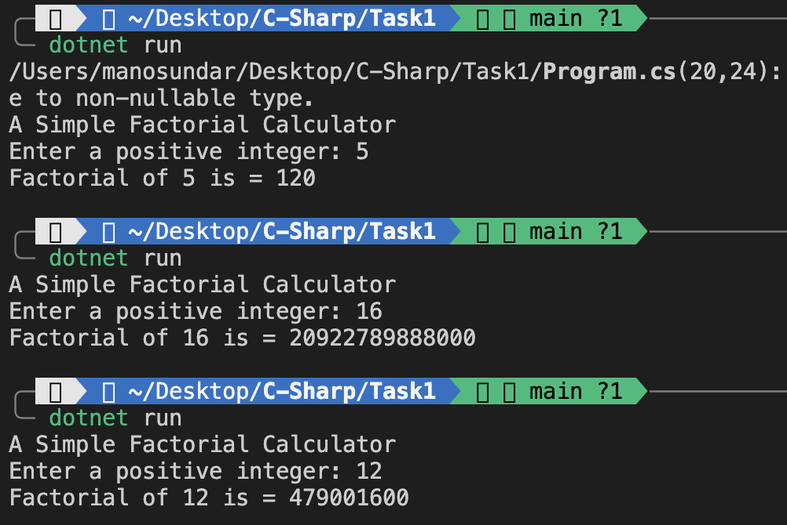

# Factorial Calculator in C#


The factorial of a number `n` (written as `n!`) is the product of all positive integers less than or equal to `n`.

For example:
```
5! = 5 × 4 × 3 × 2 × 1 = 120
```


- Input validation using `int.TryParse`
- Handles any non-negative integer input
- Uses an efficient `for` loop to calculate factorial


## Code Example

```csharp
static long CalculateFactorial(int n)
{
    long result = 1;
    for (int i = 2; i <= n; i++)
    {
        result *= i;
    }
    return result;
}
```

## Output



---


