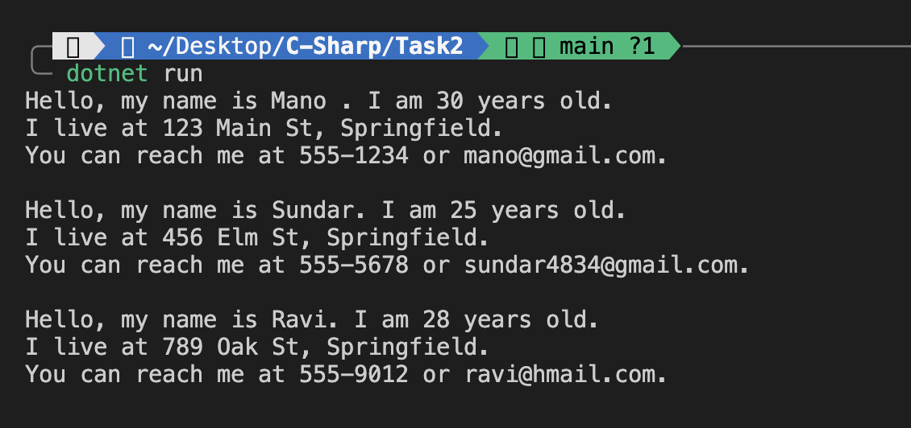

The goal of this program is to:
- Define a `Person` class with relevant properties
- Implement a method that introduces the person
- Create and use multiple instances of the class in the `Main` method

## Features
- Define a class named `Person`
- Properties include:
  - `Name` (string)
  - `Age` (int)
  - `Address` (string)
  - `PhoneNumber` (string)
  - `Email` (string)
- Method: `Introduce()`
  - Displays a formatted self-introduction message


## Code Structure
### Class: `Person`
Defines a blueprint for creating person objects. Each object holds personal data and can introduce itself.

### Properties
These are auto-implemented properties that allow reading and writing values:
```csharp
public string Name { get; set; }
public int Age { get; set; }
public string Address { get; set; }
public string PhoneNumber { get; set; }
public string Email { get; set; }
```


### Method: `Introduce()`
This method prints out a personalized introduction, using the values of the properties:
```csharp
public void Introduce()
{
    Console.WriteLine($"Hello, my name is {Name}. I am {Age} years old.");
    Console.WriteLine($"I live at {Address}.");
    Console.WriteLine($"You can reach me at {PhoneNumber} or {Email}.");
    Console.WriteLine();
}
```

### Main Method
Demonstrates object instantiation and method usage:
```csharp
Person person1 = new Person
{
    Name = "Mano",
    Age = 30,
    Address = "123 Main St, Springfield",
    PhoneNumber = "555-1234",
    Email = "mano@gmail.com"
};

Person person2 = new Person
{
    Name = "Sundar",
    Age = 25,
    Address = "456 Elm St, Springfield",
    PhoneNumber = "555-5678",
    Email = "sundar4834@gmail.com"
};

Person person3 = new Person
{
    Name = "Ravi",
    Age = 28,
    Address = "789 Oak St, Springfield",
    PhoneNumber = "555-9012",
    Email = "ravi@hmail.com"
};

person1.Introduce();
person2.Introduce();
person3.Introduce();
```

## Purpose of `get` and `set`
`get` and `set` are called accessors:
- `get` is used to retrieve the value of a property
- `set` is used to assign a value to a property


## Output
