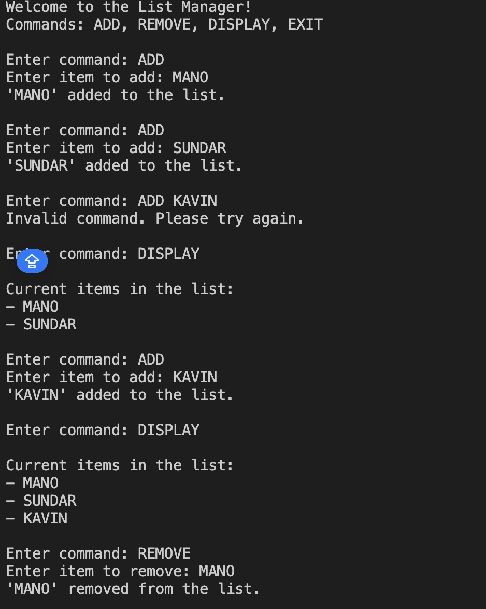

## Features

- Add items to a list
- Remove items from a list
- Display all items in the list
- Trim user input to avoid errors
- Normalize commands with `ToUpper()` for consistent handling
- Keeps running until the user chooses to exit

## Concepts Used

- `List<string>` for dynamic storage of strings
- `Console.ReadLine()` and `Console.WriteLine()` for input/output
- `Trim()` to remove extra spaces from user input
- `ToUpper()` to make commands case-insensitive
- `while` loop for continuous interaction
- `switch` statement to handle commands

## How It Works

1. The program initializes an empty `List<string>` to store items.
2. It enters a `while` loop that continues until the user types `EXIT`.
3. Inside the loop:
   - The user is prompted to enter a command (`ADD`, `REMOVE`, `DISPLAY`, or `EXIT`).
   - The command is processed using `Trim()` and `ToUpper()` to ensure consistent behavior.
   - Based on the command, the appropriate action is performed:
     - **ADD**: Adds a trimmed string to the list.
     - **REMOVE**: Tries to remove a trimmed string from the list.
     - **DISPLAY**: Prints all current items in the list.
     - **EXIT**: Ends the program.

## Sample Run

```
Welcome to the List Manager!
Commands: ADD, REMOVE, DISPLAY, EXIT

Enter command: add
Enter item to add: Complete assignment
'Complete assignment' added to the list.

Enter command: display
Current items in the list:
- Complete assignment

Enter command: remove
Enter item to remove: Complete assignment
'Complete assignment' removed from the list.

Enter command: exit
Exiting the program. Goodbye!
```

## Example of `Trim()` Usage

```csharp
string input = "   hello world   ";
string trimmed = input.Trim();
Console.WriteLine(trimmed); 
```

## Output
