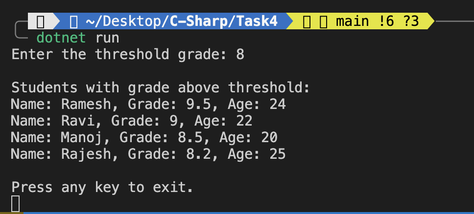

# Student Management Console App 

---

### 1. **Class Definition**
```csharp
public class Student
```
Defines a `Student` class with properties `Name`, `Grade`, and `Age`.

### 2. **List<T> Collection**
```csharp
List<Student> students = new List<Student>();
```
This is a generic collection that stores a list of `Student` objects. `List<T>` implements multiple interfaces like `IEnumerable<T>`, which allows iteration and LINQ operations.

### 3. **Object Initialization**
```csharp
new Student("Alice", 85.5, 20)
```
Populates the list with sample data using constructor initialization.

### 4. **Reading and Parsing Input**
```csharp
double.TryParse(Console.ReadLine(), out double threshold)
```
Reads user input and safely converts it to a `double` value using `TryParse`. If conversion fails, a default threshold value is used.

### 5. **LINQ Filtering**
```csharp
.Where(s => s.Grade > threshold)
```
Filters students whose grades are above the user-defined threshold.

### 6. **LINQ Sorting**
```csharp
.OrderByDescending(s => s.Grade)
```
Sorts the filtered students by grade in descending order. Can be changed to `.OrderBy(s => s.Name)` for sorting by name.

### 7. **foreach Loop**
```csharp
foreach (var student in filteredAndSorted)
```
Iterates through the filtered and sorted list to display student details.

### 8. **ToString Override**
```csharp
public override string ToString()
```
Overrides the default string representation to print student details neatly.

## Output


