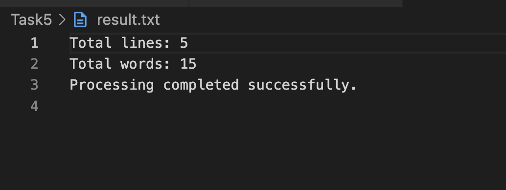
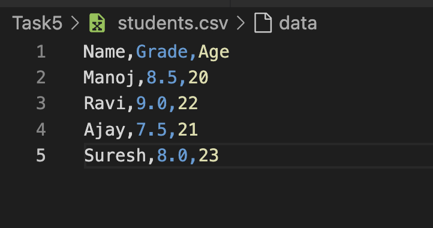
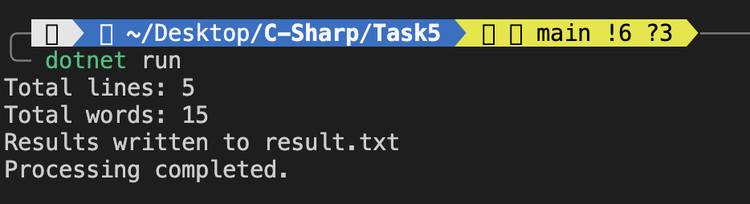

- Reads data line-by-line from a CSV file (`students.csv`).
- Processes the data to count:
  - Number of lines
  - Number of words (comma-separated values)
- Writes the result to an output text file (`result.txt`).
- Implements exception handling for:
  - File not found
  - IO exceptions
  - General exceptions


- `System.IO` namespace
- `StreamReader` for reading files efficiently
- `StreamWriter` for writing to files


## How It Works
1. Opens the input file using `StreamReader`
2. Reads each line and splits it by commas to count words
3. Tracks the total number of lines and words
4. Writes the results to `result.txt` using `StreamWriter`
5. Wraps the logic in `try-catch` blocks to handle common file I/O errors

## Error Handling
The application handles the following exceptions:
- `FileNotFoundException`: When the input file is missing
- `IOException`: For any general I/O-related issues
- `Exception`: Any unexpected runtime errors

## Output Example
```
CSV File Analysis
-------------------
Total Lines: 5
Total Words: 15
```

## Output

## Output

## Output


