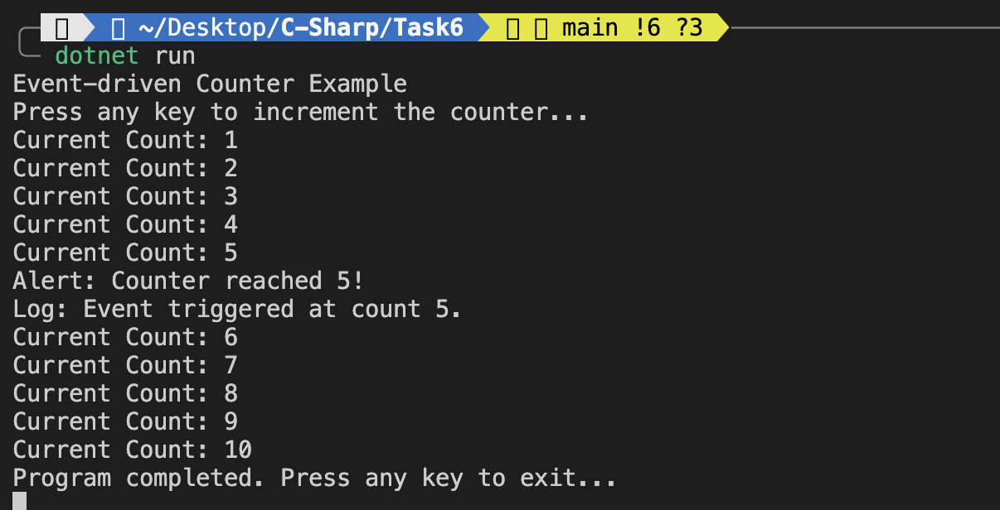

An application where a counter triggers an event when a specified threshold is reached.

---

## Features Implemented

1. **Custom Delegate**:
   - Defined a delegate `ThresholdReachedHandler` that specifies the method signature for the event handlers.

2. **Event Declaration**:
   - Used the delegate to declare an event `ThresholdReached` inside the `Counter` class.

3. **Event Raising**:
   - Within the `Increment` method, the event is triggered when the counter reaches the specified threshold.

4. **Multiple Handlers**:
   - Subscribed two event handlers: `AlertUser` and `LogToConsole`, which perform different tasks when the event is fired.

5. **Decoupling Logic**:
   - The `Counter` class only raises the event. It doesn't know what handlers will respond. This shows how events decouple producers from consumers.

---

## Execution Flow

1. **User presses a key** to increment the counter.
2. **Counter increases** by 1 and displays the count.
3. When the counter **equals the threshold**, the `ThresholdReached` event is triggered.
4. **All subscribed handlers** are executed.

---

## Sample Output
```
Press any key to increment the counter...
Current Count: 1
Current Count: 2
Current Count: 3
Current Count: 4
Current Count: 5
Alert: Counter reached 5!
Log: Event triggered at count 5.
```

---

## Output


