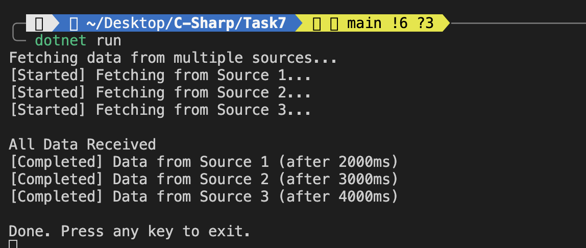

### 1. **Asynchronous Programming**
- Methods marked with `async` can perform tasks without blocking the main thread.
- The `await` keyword pauses the method execution until the awaited `Task` completes.

### 2. **`Task<T>` and `Task.WhenAll()`**
- `Task<T>` represents an asynchronous operation that returns a value.
- `Task.WhenAll()` is used to wait for multiple tasks to complete simultaneously.

### 3. **Simulating Delays with `Task.Delay()`**
- `Task.Delay()` is used to simulate time-consuming operations like API calls or I/O processes.

### 4. **Exception Handling**
- `try-catch` blocks are used to gracefully handle any exceptions that may occur during the execution of asynchronous tasks.

---


1. Three simulated data fetch operations are started concurrently using `Task<string>`.
2. Each task uses `Task.Delay()` to mimic the time delay of real operations.
3. The program waits for all tasks to complete using `await Task.WhenAll()`.
4. Once all results are gathered, they are printed to the console.
5. If any task throws an exception, it is caught and displayed.

---

## Sample Output
```
Fetching data from multiple sources...
[Started] Fetching from Source 1...
[Started] Fetching from Source 2...
[Started] Fetching from Source 3...

All Data Received
[Completed] Data from Source 1 (after 2000ms)
[Completed] Data from Source 2 (after 3000ms)
[Completed] Data from Source 3 (after 4000ms)

Done. Press any key to exit.
```

---

- Efficient use of resources by not blocking the main thread.
- Better responsiveness and performance.
- Easy to scale to more tasks without significant code changes.

---


## Output
