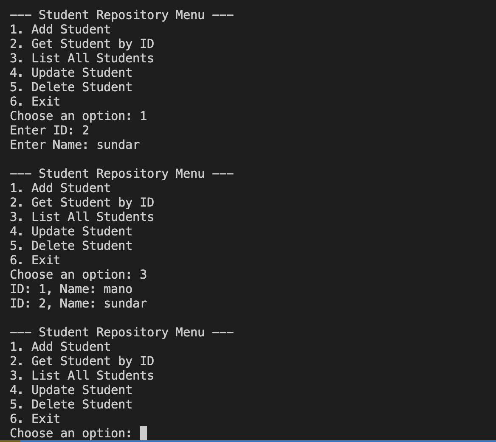

### 1. **Entity Class (Student)**
- A `Student` class is defined with properties `Id` and `Name`.
- Acts as the model or entity for the repository.

### 2. **Interface Definition (IRepository<T>)**
- A generic interface for CRUD operations:
  - `Add(int id, T item)`
  - `T Get(int id)`
  - `List<T> GetAll()`
  - `Update(int id, T item)`
  - `Delete(int id)`
- Enforces a contract for any repository implementation.

### 3. **Generic Repository (InMemoryRepository<T>)**
- Implements `IRepository<T>` using a `Dictionary<int, T>`.
- Uses Generics to work with any class (e.g., Student, Product, etc.).
- Methods handle basic in-memory storage without any database.

### 4. **Type Constraints**
- `where T : class` ensures the repository can only store reference types.

### 5. **Console UI for CRUD Operations**
- Menu-driven program to:
  - Add new students
  - Retrieve a student by ID
  - List all students
  - Update a student by ID
  - Delete a student by ID
  - Exit the application
- Demonstrates how to use the repository in a user-facing app.

---

## Output

