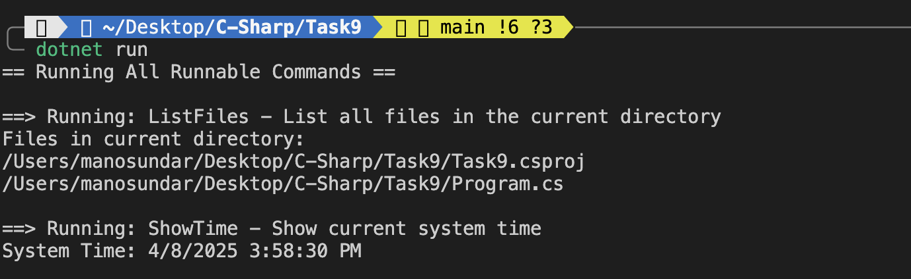

1. A custom attribute `[Runnable]` is created.
2. Some methods in different classes are marked with `[Runnable("description here")]`.
3. At runtime, reflection is used to:
   - Scan all classes
   - Find methods with the `[Runnable]` attribute
   - Execute them dynamically

---

## Code Explanation

### 1. Custom Attribute
```csharp
[AttributeUsage(AttributeTargets.Method)]
public class RunnableAttribute : Attribute
{
    public string Description { get; }

    public RunnableAttribute(string description)
    {
        Description = description;
    }
}
```
This defines a custom attribute that can be used to label methods. It stores a description that explains what the method does.

### 2. Marked Methods in Classes
```csharp
public class FileCommands
{
    [Runnable("List all files in the current directory")]
    public void ListFiles() { ... }
}

public class SystemCommands
{
    [Runnable("Show current system time")]
    public void ShowTime() { ... }
}
```
These classes contain public methods that are marked with the `[Runnable]` attribute so they can be discovered and run.

### 3. Reflection with CommandRunner
```csharp
public void RunAllRunnables()
{
    var types = Assembly.GetExecutingAssembly().GetTypes();

    foreach (var type in types)
    {
        if (!type.IsClass || type.IsSubclassOf(typeof(Attribute))) continue;

        var instance = Activator.CreateInstance(type);
        var methods = type.GetMethods(...);

        foreach (var method in methods)
        {
            var runnable = method.GetCustomAttribute<RunnableAttribute>();
            if (runnable != null)
            {
                Console.WriteLine(...);
                method.Invoke(instance, null);
            }
        }
    }
}
```
This uses reflection to:
- Find all classes in the project
- Skip attributes
- Create instances
- Find and run `[Runnable]` methods

### 4. Program Entry
```csharp
static void Main()
{
    var runner = new CommandRunner();
    runner.RunAllRunnables();
}
```
Main function that starts everything.

---


## Output



