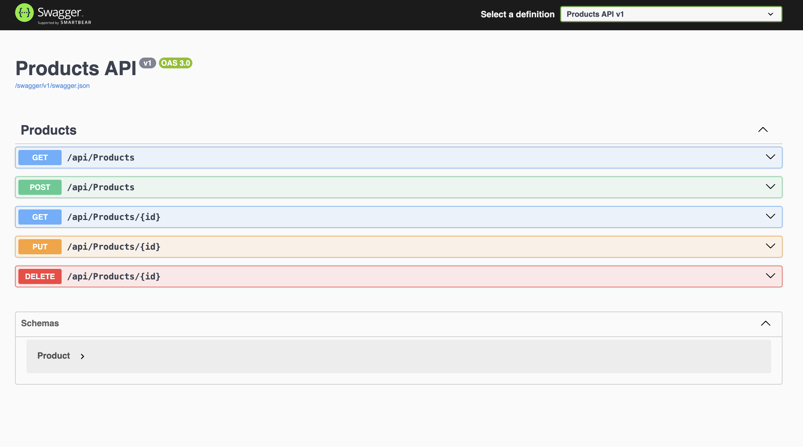
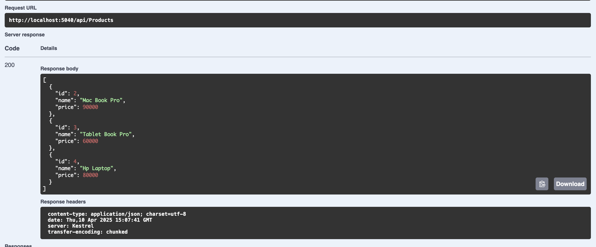
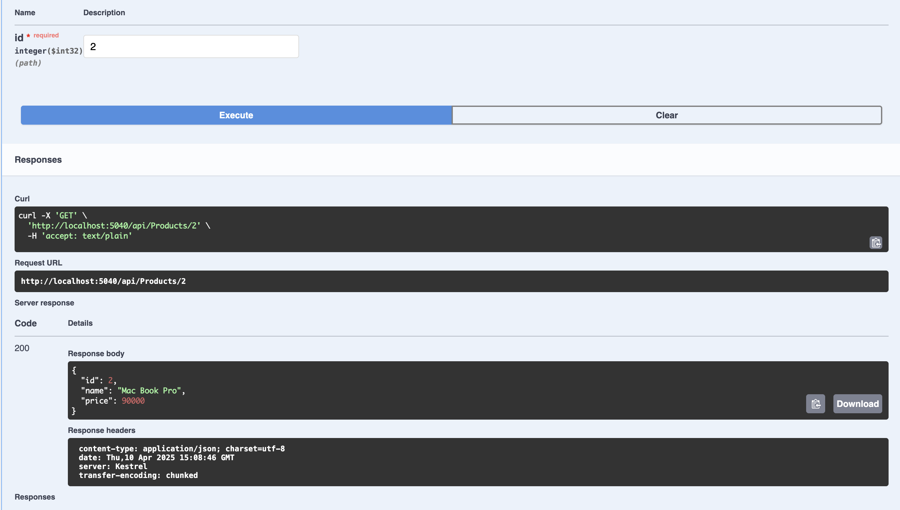
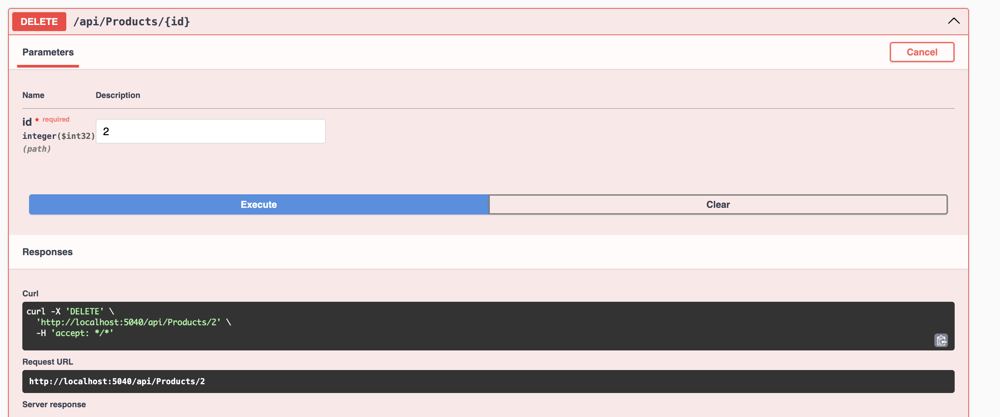

# Product API - ASP.NET Core

- **ASP.NET Core**: For building the web API.
- **Entity Framework Core**: ORM for database operations.
- **SQLite**: Lightweight database used for storing product data.
- **Swagger**: API documentation and testing tool.
- **Middleware**: Custom error handling for graceful error responses.

### 1. **Models/Product.cs**

The `Product` class defines the structure of the product object. It includes three properties:
- `Id`: Unique identifier for the product.
- `Name`: The name of the product.
- `Price`: The price of the product.

### 2. **Data/AppDbContext.cs**

`AppDbContext` inherits from `DbContext` and provides access to the `Products` DbSet, which represents the `Product` table in the SQLite database.

### 3. **Services/IProductService.cs**

Defines the contract for the `ProductService`. The interface includes methods for CRUD operations on products:
- `GetAllAsync()`: Retrieve all products.
- `GetByIdAsync(int id)`: Retrieve a product by ID.
- `CreateAsync(Product product)`: Create a new product.
- `UpdateAsync(Product product)`: Update an existing product.
- `DeleteAsync(int id)`: Delete a product by ID.

### 4. **Services/ProductService.cs**

The `ProductService` class implements `IProductService` and interacts with the database using `AppDbContext` to handle the actual CRUD operations asynchronously.

### 5. **Controllers/ProductsController.cs**

The `ProductsController` is the API controller that handles HTTP requests related to products:
- `GET /api/products`: Retrieves all products.
- `GET /api/products/{id}`: Retrieves a product by its ID.
- `POST /api/products`: Creates a new product.
- `PUT /api/products/{id}`: Updates an existing product.
- `DELETE /api/products/{id}`: Deletes a product by its ID.

### 6. **Middleware/ErrorHandlerMiddleware.cs**

Custom middleware for handling unhandled exceptions. If an exception occurs during the request pipeline, it logs the error and sends a standardized JSON response with a 500 status code.

### 7. **Program.cs**

The entry point for the application. This file:
- Sets up services, including `DbContext`, `ProductService`, and middleware.
- Configures Swagger UI for API documentation and testing.
- Ensures the SQLite database is created if it doesn't exist.

## Output

